# Credit Risk Analysis

## Overview

To better determine potential customers' credit risk, we employee several Supervised Machine Learning Algorithms to determine if there is a model that does a decent job of predicting credit risk.  We first utilize three methods of sampling algorithms and use logistic regression to make predictions to evaluate the models.  Second, we utilize an over and undersampling method called SMOTEENN. Finally, we use two Ensemble Classifiers.  For all these methods, we calculate the balanced accuracy score, create the confusion matrix, and generate a classification report so we can evaluate each and compare effectiveness in determining credit risk across all models.

## Results

The results of the six different learning models are displayed below for easy comparison.  To determine the best option in the learning models, we focused in on the Balance Accuracy Score, Precision, Recall/Sensitivity, and F1 scores.  Following the chart, you'll find the individual results captured for each of these metrics. 

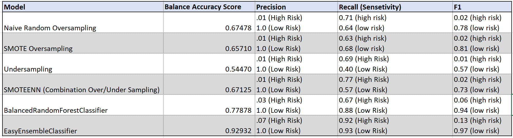

* Naive Random Sampling - The Accuracy score for this model is not good at .67, we want it to be closer to 1.0. Coupled with the very low precision of .01, only so-so precision at .71 and a very low F1 score, this model is not a good fit for identifying high risk customers. 

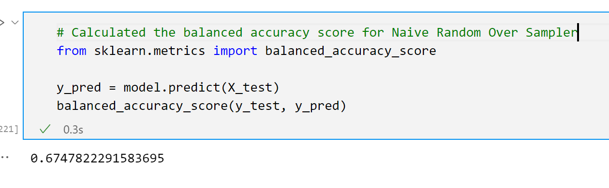
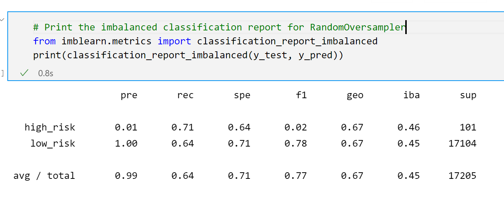

* SMOTE - This Sampling method resulted in similar scores as the Random Sampling method with even lower scores for the balance accuracy score and recall.  It is not a good fit for our dataset.

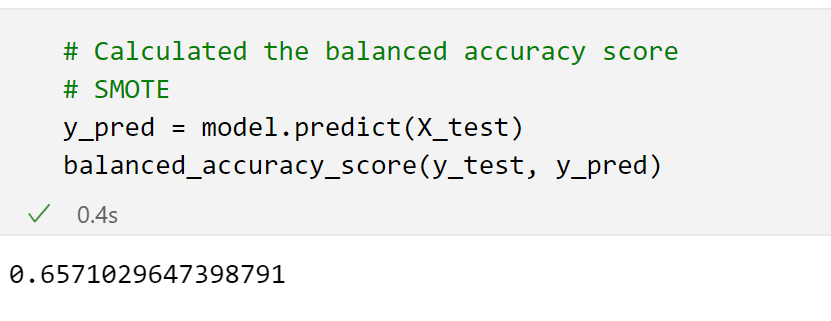
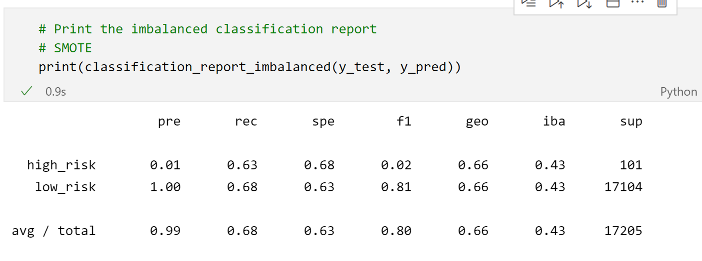

* Cluster Centroids -  This sampling method is also not a good fit with low scores similar to the previous other sampling methods.

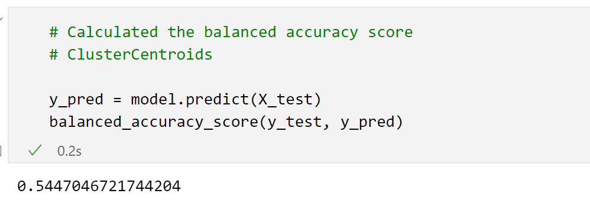
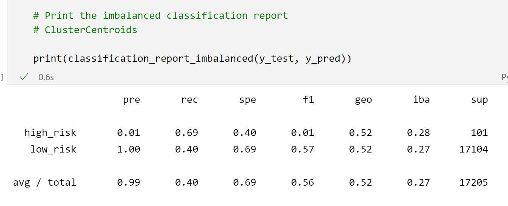

* SMOTEENN - This method uses a combination of over and under-sampling to evaluate the data.  The test shows that it too falls short in the key scores that would indicate a good fit.

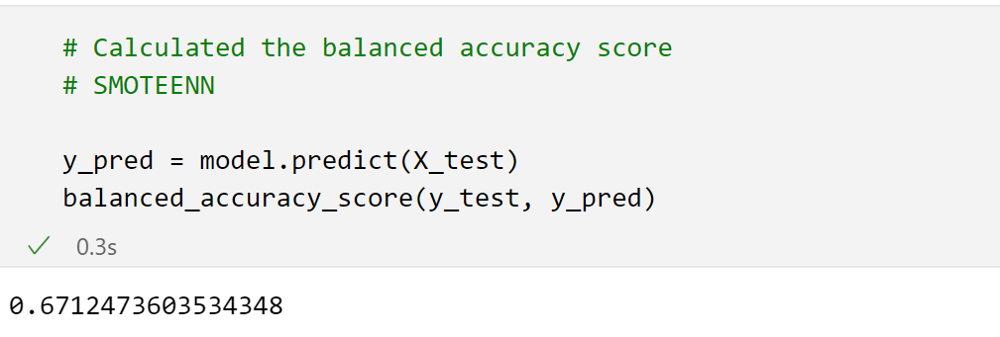
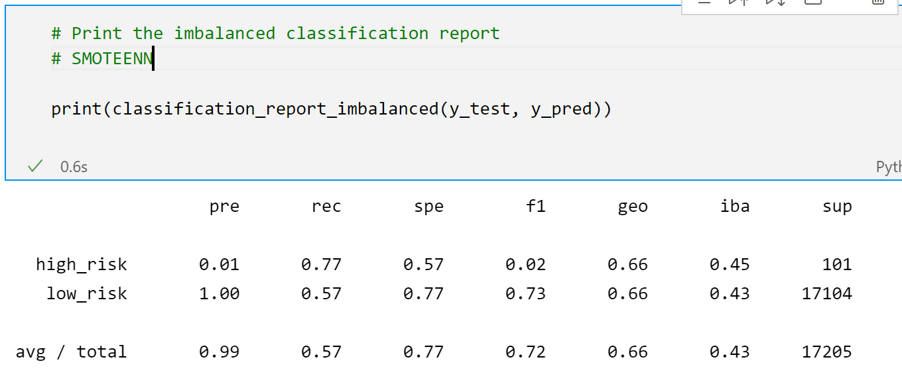

* Balanced Random Forest Classifier - This forest classification method had a slightly better balance accuracy score at .78 but the other metrics fall short like the previous sampling methods.

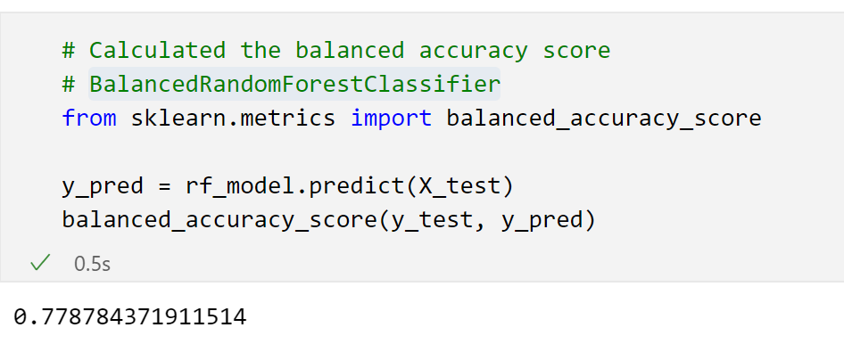
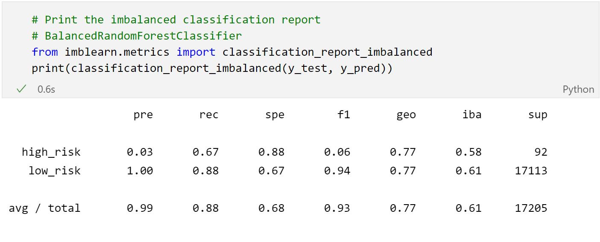

* Easy Ensemble Classifier - The Adaptive Boosting method of Machine Learning resulted in the best scores.  The balance accuracy score was the closest to 1 at .929.  All the other metrics were improved over all the previous tests with Sensitivity at a .92.  The precision of the model is low at .07 but because the Sensitivity is high, we know there is usually a trade-off with precision.  The F1 score is still not great but expected because there's a pronounced imbalance between sensitivity and precision.

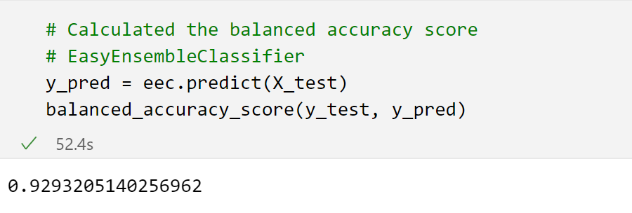
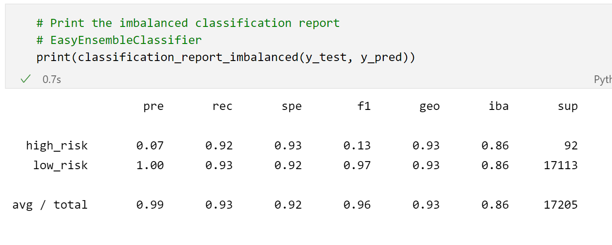

## Summary

In summary, we found that the Boosting Machine Learning model AdaBoost produced the best scores for balanced accuracy and sensitivity/recall. The precision was very low so there are a lot of records flagged as High Risk which were not high-risk. We think the trade-off is worth it though, since a customer flagged as possibly high-risk can be further analyzed in other ways specific to the individual case and moved to low-risk following other analysis.  
